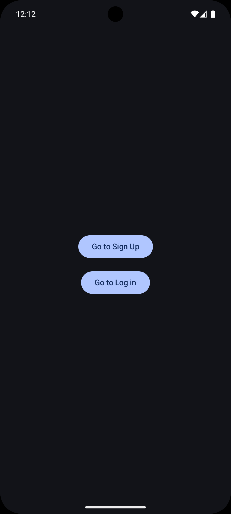
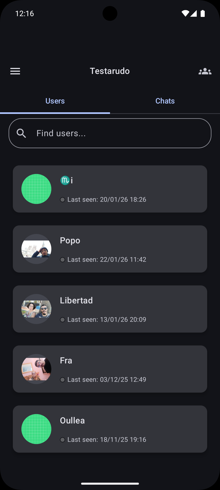
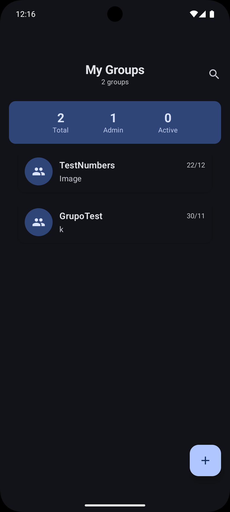
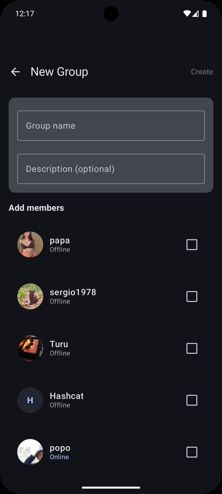
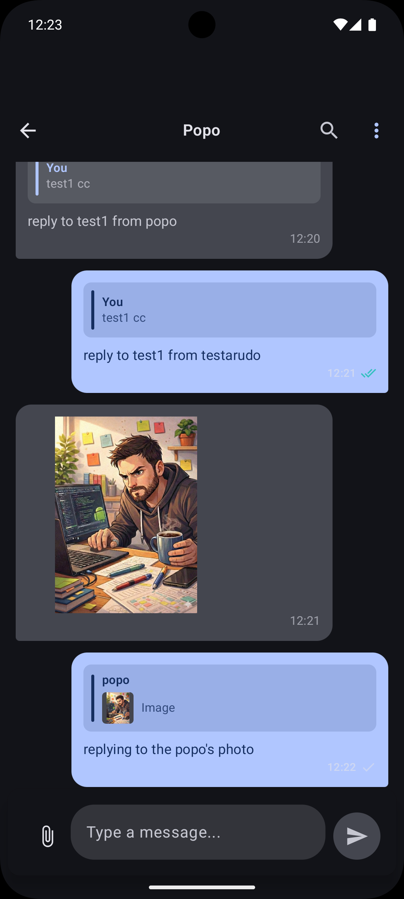

<h1 align="center"> Chat App </h1>

ChatApp es una aplicación de mensajería en tiempo real desarrollada en Kotlin utilizando Jetpack Compose como framework de interfaz de usuario.  
La aplicación permite a los usuarios registrarse o iniciar sesión, enviar y recibir mensajes en tiempo real y recibir notificaciones push cuando llegan nuevos mensajes.  
Está construida sobre servicios de Firebase e implementada siguiendo el patrón de arquitectura MVVM.

<h4 align="center">
:construction: Proyecto en construcción :construction:
</h4>

---

## Objetivo del proyecto

El propósito de esta aplicación es demostrar el desarrollo de una solución de chat moderna utilizando tecnologías actuales del ecosistema Android, aplicando buenas prácticas de arquitectura, gestión de estado y comunicación con servicios en la nube.

---

## Funcionalidades

### Autenticación
- Registro e inicio de sesión con correo y contraseña (Firebase Authentication)

### Mensajería en tiempo real

- Envío de mensajes de texto e imágenes
- **Funcionalidad de respuesta (Reply)** - Responder a mensajes específicos como en WhatsApp
- Recepción automática de mensajes sin recargar la interfaz
- Almacenamiento en Firebase Realtime Database
- Estado de lectura de mensajes

### Notificaciones Push
- Envío de notificaciones mediante Cloud Messaging
- Recepción de notificaciones cuando la app está en segundo plano

### Interfaz de usuario
- Diseño completamente declarativo con Jetpack Compose
- Navegación entre pantallas con Navigation Compose
- Actualización automática de estado con ViewModel + State/Flow
- **Vista previa de respuestas** con indicadores visuales
- **Long press** en mensajes para activar respuesta
- **Diseño adaptativo** para mensajes propios y de otros usuarios

---

## Arquitectura

Se utiliza el patrón de diseño MVVM (Model View Viewmodel) para mantener una separación clara entre interfaz, lógica de presentación y acceso a datos.
Esta estructura facilita la escalabilidad, la reutilización de lógica y la capacidad de testear componentes.

### Capas implementadas:

- **Presentation**: Compose UI, ViewModels, Estados
- **Domain**: Use Cases, Repository Interfaces
- **Data**: Repository Implementations, Firebase Integration

---

## Tecnologías y herramientas

**Lenguaje:** Kotlin  
**UI:** Jetpack Compose, Material 3  
**Arquitectura:** MVVM, Clean Architecture, ViewModel, StateFlow  
**Backend:** Firebase Authentication, Realtime Database, Cloud Messaging, Storage  
**Navegación:** Navigation Compose  
**Inyección de dependencias:** Hilt  
**Concurrencia:** Kotlin Coroutines / Flow  
**Control de versiones:** Git + GitHub  
**IDE:** Android Studio

---

## Vista previa de la aplicación


<p align="center">
  
  &nbsp;&nbsp;&nbsp;
  
  &nbsp;&nbsp;&nbsp;
  
</p>

<p align="center">
  <b>1. Bienvenida &nbsp;&nbsp;&nbsp;&nbsp;&nbsp;&nbsp;&nbsp;&nbsp;&nbsp;&nbsp;&nbsp;&nbsp;&nbsp;&nbsp;&nbsp;&nbsp;&nbsp;&nbsp;&nbsp;&nbsp;&nbsp; 2. Login &nbsp;&nbsp;&nbsp;&nbsp;&nbsp;&nbsp;&nbsp;&nbsp;&nbsp;&nbsp;&nbsp;&nbsp;&nbsp;&nbsp;&nbsp;&nbsp;&nbsp;&nbsp;&nbsp;&nbsp;&nbsp;&nbsp;&nbsp;&nbsp;&nbsp;&nbsp;&nbsp; 3. Home (Usuarios)</b>
</p>

<br>

<p align="center">
  
  &nbsp;&nbsp;&nbsp;
  
  &nbsp;&nbsp;&nbsp;
  
</p>

<p align="center">
  <b>4. Grupos &nbsp;&nbsp;&nbsp;&nbsp;&nbsp;&nbsp;&nbsp;&nbsp;&nbsp;&nbsp;&nbsp;&nbsp;&nbsp;&nbsp;&nbsp;&nbsp;&nbsp;&nbsp;&nbsp;&nbsp;&nbsp;&nbsp;&nbsp;&nbsp;&nbsp; 5. Crear Grupo &nbsp;&nbsp;&nbsp;&nbsp;&nbsp;&nbsp;&nbsp;&nbsp;&nbsp;&nbsp;&nbsp;&nbsp;&nbsp;&nbsp;&nbsp;&nbsp;&nbsp;&nbsp;&nbsp;&nbsp;&nbsp; 6. Chat con Respuesta</b>
</p>

---

## Ejecución del proyecto

1. Clonar el repositorio.
2. Abrir el proyecto en Android Studio (Arctic Fox o superior).
3. Crear un proyecto en Firebase y descargar `google-services.json`.
4. Colocar el archivo en la carpeta app
5. Habilitar los siguientes servicios en Firebase:
  - Authentication (Email/Password)
  - Realtime Database
  - Cloud Messaging
  - Storage (para imágenes)
6. Sincronizar Gradle.
7. Crear el backend para las notificaciones con node.js y enlazarlo al proyecto.
8. Ejecutar la aplicación en un dispositivo o emulador.

---

## Estructura de datos (Firebase Realtime Database)

Ejemplo de cómo se almacenan los mensajes:

```
Chats/
  Messages/
    chatId/
      messageId/
        senderId: String
        receiverId: String
        message: String
        timestamp: Long
        messageType: "TEXT" | "IMAGE"
        readStatus: "SENT" | "READ"
        replyToMessageId: String? (nuevo)
        replyToMessage: String? (nuevo)
        replyToSenderId: String? (nuevo)
        replyToMessageType: "TEXT" | "IMAGE"? (nuevo)
```

---

## Funcionalidad de Reply

### Cómo usar:
1. **Mantén presionado** cualquier mensaje
2. Escribe tu respuesta en el campo de texto
3. El mensaje se enviará como respuesta al mensaje original
4. **Toca** la vista previa del reply para ir al mensaje original

### Características:

- ✅ Vista previa del mensaje original con miniaturas de imagen
- ✅ Indicadores visuales distintivos
- ✅ Soporte para responder a texto e imágenes
- ✅ **Navegación al mensaje original** con scroll automático
- ✅ **Animación de highlight avanzada** para mensajes respondidos
- ✅ **Transiciones sincronizadas** para experiencia fluida
- ✅ Compatibilidad total con mensajes existentes

---

## Buenas prácticas aplicadas

- Separación de responsabilidades (MVVM + Clean Architecture)
- Uso de ViewModel para gestión del ciclo de vida
- UI declarativa con Compose
- Gestión reactiva de estado con Flow
- Abstracción de acceso a datos con Repository
- Navegación desacoplada entre pantallas
- **Inyección de dependencias** con Hilt
- **Use Cases** para lógica de dominio
- **Estados inmutables** y programación reactiva

---

## Mejoras planificadas

- Scroll automático al mensaje original al tocar una respuesta
- Respuestas anidadas (responder a una respuesta)
- Encriptación de mensajes
- Chats grupales con menciones
- Tests unitarios para ViewModels y lógica de dominio
- Estados avanzados (loading, error, vacío)
- Modo oscuro mejorado

---

## Objetivo profesional

Este proyecto forma parte de mi portafolio como desarrollador Android, con el objetivo de mostrar experiencia en:
- Desarrollo de apps modernas con Compose
- Integración con servicios backend (Firebase y node.js)
- Aplicación de arquitectura limpia
- Buenas prácticas de código y escalabilidad
- **Implementación de funcionalidades complejas** como el sistema de respuestas

---

## Autor

[<br><sub>Yeray Yas</sub>](https://github.com/yeray-yas)
:---:
Android Developer   

